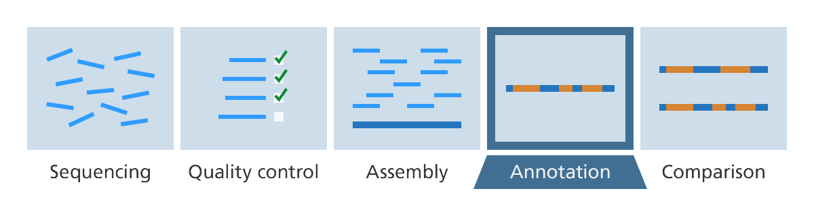

```{r meta, echo=FALSE}
library(metathis)
meta() %>%
  meta_general(
    description = "Intro",
    generator = "xaringan and remark.js"
  ) %>% 
  meta_name("github-repo" = "sandragodinhosilva/microbiomes2021") %>% 
  meta_social(
    title = "Intro",
    url = "https://sandragodinhosilva/microbiomes2021/slides/day-01-basics.html#1",
    image = "https://raw.githubusercontent.com/sandragodinhosilva/microbiomes2021/main/slides/day-01-cover-image.png",
    image_alt = "Title slide",
    og_type = "website",
    og_author = "Sandra Godinho Silva",
    twitter_card_type = "summary_large_image",
    twitter_creator = "@SandraGodSilva"
  )
```

```{r set-theme, include=FALSE}
library(xaringanthemer)
style_duo_accent(
  primary_color      = "#0F4C81", # pantone classic blue
  secondary_color    = "#B6CADA", # pantone baby blue
  header_font_google = google_font("Raleway"),
  text_font_google   = google_font("Raleway", "300", "300i"),
  code_font_google   = google_font("Source Code Pro"),
  text_font_size     = "25px"
)
```

```{r setup, include = FALSE}
options(htmltools.dir.version = FALSE)
library(knitr)
library(broom)
library(icons)
library(scales)
library(openintro)
library(jsonlite)
library(tidyverse)
library(xaringanExtra)
library(nhsrtheme)
library(NHSRdatasets)
# set default options
opts_chunk$set(echo=FALSE,
               collapse = TRUE,
               fig.width = 7.252,
               fig.height = 4,
               dpi = 300)
# set engines
knitr::knit_engines$set("markdown")
xaringanExtra::use_tile_view()
xaringanExtra::use_panelset()
xaringanExtra::use_clipboard()
xaringanExtra::use_webcam()
xaringanExtra::use_broadcast()
xaringanExtra::use_share_again()
xaringanExtra::style_share_again(
  share_buttons = c("twitter", "linkedin", "pocket")
)

```


class: title-slide, right, top
background-image: url(img/jeremy-bishop-G9i_plbfDgk-unsplash.jpg)
background-position:  75% 75%
background-size: cover

.right-column[
# `r rmarkdown::metadata$title`
#### `r rmarkdown::metadata$subtitle`

**`r rmarkdown::metadata$author`**<br>
`r rmarkdown::metadata$date`
]

???
.small[.left[.footnote[Graphic by [Vernon Adams](https://unsplash.com/photos/jlrnBE3Jn3o)]]]

---
name: about-me
class: center, middle

## About me: Sandra Godinho Silva


### PhD Student @ Institute for Bioengineering and Biosciences

.fade[Instituto Superior Técnico<br>Lisbon, Portugal]

[`r icons::fontawesome("orcid")` Orcid](https://orcid.org/0000-0002-4763-0662)
[`r icons::icon_style(icons::fontawesome("github"), scale = 1)` @sandragodinhosilva](https://github.com/sandragodinhosilva)

???
[`r icons::fontawesome("link")` sandragodinhosilva.netlify.com](https://sandragodinhosilva.netlify.com)
[`r icons::fontawesome("twitter")` @SandraGodSilva](https://twitter.com/SandraGodSilva)
---
class:  center, middle

# Bioinformatics

Bioinformatics is the science that conjugates  
**biology** + **statistics** + **computer sciences**  
to study biological issues through the analysis of data.

---
class: middle

**Bioinformatics is a constantly changing and updating field.**

Fast developments in:
> - .my-coral[software]
- computing hardware 
- high throughput technologies 

--

are creating a significant bottleneck:  
**How to thoroughly analyze this massive amount of data?**

---
.center[**How to thoroughly analyze this massive amount of data?**]

```{r bigdata, echo=FALSE, out.width="70%", fig.align="center"}
knitr::include_graphics("img/bigdata_lifesciences.png")
```
.center[
[Stephens et a. PLoS Biology, 2015.](https://journals.plos.org/plosbiology/article?id=10.1371/journal.pbio.1002195)
]

---
## Integrative OMICS
```{r integrative, echo=FALSE, out.width="80%", fig.align="center"}
knitr::include_graphics("img/integrative_omics.png")
```
.center[
.small[[Yugi et al., Trends Biotechnol. 2016 Apr; 34(4):276–290](https://doi.org/10.1016/j.tibtech.2015.12.013)]
]

---
## Choose the most appropriate route for you

Nowadays, bioinformaticians and researchers working in life scientists can choose from an overwhelming collection of exciting technologies and programming languages.  

--

Several options:
- [Web-based platforms](#Web-based)

--

- [Scripting/programming](#scripting)

---
name: Web-based
# Web-based platforms

Allow **accessible**, **reproducible**, and **transparent computational research.**

.panelset[

.panel[.panel-name[KBase]

.left-column[
```{r kbase, echo=FALSE, out.width="100%"}
knitr::include_graphics("img/KBase-logo.png")
```
]
.right-column[The U.S. Department of Energy Systems Biology Knowledgebase [KBase](https://www.kbase.us/)  is an open-source software and data platform designed to meet the grand challenge of systems biology — predicting and designing biological function from the biomolecular (small scale) to the ecological (large scale).
]]


.panel[.panel-name[Galaxy]
.left-column[
```{r galaxy, echo=FALSE, out.width="100%"}
knitr::include_graphics("img/galaxy.png")
```
]
.right-column[Galaxy provides a system that enables researchers without informatics expertise to perform computational analyses through the web. A user interacts with Galaxy through the web by uploading and analyzing the data. Galaxy interacts with underlying computational infrastructure (servers that run the analyses and disks that store the data) without exposing it to the user.
(https://galaxyproject.org/)
]]
]


---
name: scripting
# Scripting & programming

.panelset[

.panel[.panel-name[Bash]
.left-column[
```{r bash, echo=FALSE, out.width="100%"}
knitr::include_graphics("img/bash.png")
```
]
.right-column[
* Default login shell for most Linux distributions;
* Simple bash scripts are really useful for data manipulation.
]
]

.panel[.panel-name[Python (1/2)]
.left-column[
```{r python, echo=FALSE, out.width="80%"}
knitr::include_graphics("img/python.png")
```
]
.right-column[
* Clear and powerful object-oriented programming language;
* Portable – runs just about anywhere;
* Clear syntax – relatively easy to learn.
Source: [https://www.python.org/](https://www.python.org)]
]

.panel[.panel-name[Python (2/2)]

.left-column[
```{r biopython, echo=FALSE, out.width="100%"}
knitr::include_graphics("img/Biopython_logo.svg")
```
]
.right-column[
## Biopython
* Collection of .blue[Python] modules that provide functions to deal with DNA, RNA & protein sequence operations;
* It has sibling projects like BioPerl, BioJava and BioRuby.
Source: [https://biopython.org/](https://biopython.org)
]
]

.panel[.panel-name[R (1/3)]
.left-column[
```{r rlogo, echo=FALSE, out.width="100%"}
knitr::include_graphics("img/Rlogo.png")
```
]
.right-column[
* .purple[R] is a powerful, popular open-source scripting language
* More than 20 years old - fairly mature - and growing in popularity. 
]
]


.panel[.panel-name[R (2/3)]
## Why is R so popular?
]

.panel[.panel-name[R (3/3)]
.left-column[
```{r rstudio, echo=FALSE, out.width="100%"}

```
]
.right-column[
## R Studio
* Integrated Development Environment (IDE). 
* Provides a graphical interface to R, making it more user-friendly, and providing dozens of useful features.
.midi[Source: [https://www.rstudio.com/](https://www.rstudio.com/)
]
]

]

]

---

# And much more!

```{r programming, echo=FALSE, out.width="55%",fig.align = "center"}
knitr::include_graphics("img/programming_languages.jpeg")
```


---
class: inverse, center, middle

## Break
### **Any questions?**
---
# Genome Annotation

Genome annotation is the process of attaching biological information to sequences.  

<br>

**Consists of two main steps:** 
- structural annotation: identifying genomic elements;

- functional annotation: attaching biological information to these elements. 

<br>
```{r gn, echo=FALSE, out.width="70%",fig.align = "center"}

```
.center[.small[
Source: [link](https://zhiganglu.com/post/annotation-pipeline-tools/)]
]
???
Gene annotation is the plotting of genes onto genome assemblies, and indexing their genomic coordinates.
DNA annotation or genome annotation is the process of identifying the locations of genes and all of the coding regions in a genome and determining what those genes do.
---
## Key points:
* Once a genome is sequenced, all of the sequences must be analyzed to understand what their meaning.

* Critical to annotation is the identification of the genes in a genome, the structure of the genes, and the proteins they encode.

* Once a genome is annotated, further work is done to understand how all the annotated regions interact with each other.

???


 
---
```{r genome_annot, echo=FALSE, out.width="70%", fig.align="center", fig.cap="Source: https://www.ssbs.edu.in/genome-annotation.htm"}
knitr::include_graphics("img/genome-annotation.jpg")
```

???
Genome Annotation is the process to identify, analyze and interpret the relevant information related to the raw DNA sequences. Genome Annotation helps to extract structural location and biological functions of genes. Haemophilus influenza was the first free-living bacterium to be decoded in 1995 by Dr. Owen White. The assembling of the quality reads with a reference genome or de novo assembly in order to obtain the complete genome is a primary requirement for Genome Annotation.

---
# Structural Annotation
The process of identifying genomic elements such as: 
* open reading frames (ORFs) and their localization;

* gene structure;

* coding regions;

* regulatory motifs.

???
Genome annotation is thus the process of attaching
biological information to the genome sequences and starts by identifying the positions of structural
genomic elements, like genes, exons, introns, repeated regions, promoters, etc
---
# Structural Annotation: Methods
.pull-left[
* **Similarity**  
Similarity between sequences 

<br><br>
```{r sim, echo=FALSE, out.width="70%", fig.align="center"}
knitr::include_graphics("img/scorelink.png")
```

]

.pull-right[* ***ab-initio* prediction**  
Genes are predicted based on gene content and signal detection (e.g. start/stop codon; Ribosome Biding Site (RBS), etc.).


```{r ab, echo=FALSE, out.width="50%", fig.align="center"}
knitr::include_graphics("img/abinitio.png")
```

]

???


In another words, they predict genes by analyzing statistical features of genes first, then separate the coding sequences and non-coding sequences apart.

---
Examples of tools available: 
* Glimmer
* GenemarkHMM 
---
.huge[**PRODIGAL**]  
**PROkaryotic DYnamic programming Gene-finding ALgorithm**

- Predicts protein-coding genes 
- Handles gaps and partial genes
- Identifies translation initiation sites
- Handles finished genomes, draft genomes and metagenomes.
- Runs quickly
- Runs unsupervised:  
Prodigal is an **unsupervised machine learning algorithm**.  
Automatically learns the properties of the genome from the sequence itself, including RBS motif usage, start codon usage, and coding statistics.

Source: [https://github.com/hyattpd/Prodigal](https://github.com/hyattpd/Prodigal)

---

```{r gene_structure, echo=FALSE, out.width="55%", fig.align="center"}
knitr::include_graphics("img/prokaryote_gene.png")
```

https://www.researchgate.net/publication/266155655_Accurate_RNA-seq_based_de_novo_annotation_using_mGenengs
---
# Functional Annotation

The process of **attaching biological information to genomic elements** by describing the biochemical and biological function of proteins. 

Possible analysis:

* similarity searches;
* gene cluster prediction for secondary metabolites;
* identification of transmembrane domains in protein sequences;
* finding gene ontology terms;
* pathway information.

Functional roles are assigned to coding sequences (CDSs)
---


--- 
## Functional annotation - Homology based

---
Orthology search

## Functional annotation- other features: Ontologies

---
## Take-home messages
The annotation accuracy is only as good as the available suporting data 
As new data becomes available, gene predictions and functional assignments will change

Ex: Characterization of hypotetical proteins

.cite[Garbage in, garbage out]

---
**Practical example:**  

For similarity searches, it is common to use **BLAST (Basic Local Alignment Search Tool)**  

BLAST finds regions of similarity between biological sequences. The program compares nucleotide or protein sequences to sequence databases and calculates the statistical significance.

```{r blast, echo=FALSE, out.width="55%", fig.align="center"}
knitr::include_graphics("img/blast.png")
```

???
Widely used sequence similarity search tool

Find high scoring local alignments between two sequences

Includes a model of score distributions for random local alignments

Provides statistical significance for alignments

Mostly used for 

I have a Dna or protein sequences
1. What is it related to? What does it do? (Homology, Conseerved Domains)
2. Is is already in the database? (Identification)
3. Where is it located or how is it organized? (Annotation, Assembly)

---
# Process Annotation


---
# Homologs, Orthologs, and Paralogs

* **Homologous gene** (homolog): **a gene inherited in two species by a common ancestor**.  

<br>

```{r homologs, echo=FALSE, out.width="70%", fig.align="center"}

```

<br>
.small[Homologous DNA: sequence alignment of a homologous protein from two different species.  The “*” represents a conserved amino acid in the two proteins. Figure: [link](https://s3-us-west-2.amazonaws.com/courses-images/wp-content/uploads/sites/1950/2017/05/31184035/zinc-finger-seq-alignment2.png)]

---
While homologous genes can be similar in sequence, similar sequences are not necessarily homologous.
* **Orthologous** are homologous genes where a gene diverges after a speciation event, but the gene and its main function are conserved.

* If a gene is duplicated in a species, the resulting duplicated genes are **paralogs** of each other, even though over time they might become different in sequence composition and function.


???
Homology forms the basis of organization for comparative biology.
A homologous trait is often called a homolog (also spelled homologue). In genetics, the term “homolog” is used both to refer to a homologous protein and to the gene ( DNA sequence) encoding it. 

As with anatomical structures, homology between protein or DNA sequences is defined in terms of shared ancestry. 

Two segments of DNA can have shared ancestry because of either a speciation event (orthologs) or a duplication event (paralogs). 

Homology among proteins or DNA is often incorrectly concluded on the basis of sequence similarity. The terms “percent homology” and “sequence similarity” are often used interchangeably. As with anatomical structures, high sequence similarity might occur because of convergent evolution, or, as with shorter sequences, because of chance. Such sequences are similar, but not homologous. Sequence regions that are homologous are also called conserved. This is not to be confused with conservation in amino acid sequences in which the amino acid at a specific position has been substituted with a different one with functionally equivalent physicochemical properties. One can, however, refer to partial homology where a fraction of the sequences compared (are presumed to) share descent, while the rest does not. For example, partial homology may result from a gene fusion event.
---


---

# Tools for genome annotation

BLAST can be considered the basic level of annotation for finding similarities and then annotating genomes based on that. 

Other databases use genome context information, similarity scores, experimental data, and integrations of other resources to provide genome annotations through their Subsystems approach. Other databases rely on both curated data sources as well as a range of different software tools in their automated genome annotation pipeline.

???
Automatic annotation tools try to perform all of this by computer analysis, as opposed to manual annotation (a.k.a. curation) which involves human expertise. Ideally, these approaches co-exist and complement each other in the same annotation pipeline (process). 
The basic level of annotation is using BLAST for finding similarities, and then annotating genomes based on that. However, nowadays more and more additional information is added to the annotation platform. The additional information allows manual annotators to deconvolute discrepancies between genes that are given the same annotation. 

Some databases use genome context information, similarity scores, experimental data, and integrations of other resources to provide genome annotations through their Subsystems approach. Other databases rely on both curated data sources as well as a range of different software tools in their automated genome annotation pipeline.

https://bio.libretexts.org/Bookshelves/Microbiology/Book%3A_Microbiology_(Boundless)/7%3A_Microbial_Genetics/7.13%3A_Bioinformatics/7.13B%3A_Annotating_Genomes


Many of these features can be automatically predicted by sophisticated software packages based on sequence or structure comparisons.

Beyond this point, it is the goal and the job of a community annotation to generate accurate lists of the most crucial and interesting genes from a new genome, with raw data in the form of gene predictions with numbers attached, gaps in the draft genome sequence, and transcriptome alignments. In short, the goal at this point, is to convert the raw, machine generated data into a useable and useful data resource that will advance research in new, powerful and exciting directions.


---
Prokka

[Tutorial](https://training.galaxyproject.org/training-material/topics/genome-annotation/tutorials/annotation-with-prokka/tutorial.html)
---
# Databases

.panelset[

.panel[.panel-name[PFAM]
.left-column[
.center[
```{r pfam, echo=FALSE, out.width="100%", fig.align="center"}
knitr::include_graphics("img/pfam.gif")
```
]
]
.right-column[
Pfam is a large collection of protein families, represented by multiple sequence alignments and hidden Markov models (HMMs).  
Source: [http://pfam.xfam.org/](http://pfam.xfam.org/)
]
]

.panel[.panel-name[COG]
.left-column[
# COG
]
.right-column[
**Clusters of Orthologous Groups (COGs)**
Database of proteins generated by comparing the protein sequences of complete genomes. Each cluster contains groups of paralogs from at least three lineages.  
Source: [https://www.ncbi.nlm.nih.gov/research/cog-project/](https://www.ncbi.nlm.nih.gov/research/cog-project/)
]
]

.panel[.panel-name[Kegg]
.left-column[
```{r kegg, echo=FALSE, out.width="100%"}
knitr::include_graphics("img/KEGG_database_logo.gif")
```
]
.right-column[
**Kyoto Encyclopedia of Genes and Genomes**
Database resource for understanding high-level functions and utilities of biological systems, such as the cell, the organism and the ecosystem, from molecular-level information.  
Source: [https://www.genome.jp/kegg/](https://www.genome.jp/kegg/)
]
]

.panel[.panel-name[CAZymes]
.left-column[
```{r cazymes, echo=FALSE, out.width="150%"}
knitr::include_graphics("img/cazymes.png")
```
]
.right-column[
**Carbohydrate-Active enZymes**
Enzymes involved in the synthesis, metabolism, and transport of carbohydrates. 
CAZymes are organized in families in the continuously updated database [CAZy](www.cazy.org).
Source: [http://www.cazy.org/](http://www.cazy.org/)
???
Includes: glycoside hydrolases (GHs), glycosyltransferases (GTs), polysaccharide lyases (PLs), carbohydrate esterases (CEs) and carbohydrate binding modules (CBMs). 
]
]

]
---
## Introduction to File Formats
.panelset[

.panel[.panel-name[FASTA]

DNA and protein sequences can be written in FASTA format.
First line:">" followed by the description. 
In the second line the sequence starts.

```{r fasta, echo=FALSE, out.width="50%",fig.align = "center"}
knitr::include_graphics("img/fasta.png")
```

]

.panel[.panel-name[GFF3]

General feature format (gene-finding format, generic feature format, GFF) is a file format used for describing genes and other features of DNA, RNA and protein sequences.

```{r gff3, echo=FALSE, out.width="70%",fig.align = "center"}

```
]


.panel[.panel-name[GENBANK]

The genbank sequence format is a rich format for storing sequences and associated annotations.

```{r genbank, echo=FALSE, out.width="50%",fig.align = "center"}
knitr::include_graphics("img/gb_full.png")
```

]
]


???
Source: https://training.galaxyproject.org/training-material/topics/genome-annotation/tutorials/genome-annotation/tutorial.html


---

```{r melange, echo=FALSE, out.width="100%"}
knitr::include_graphics("img/melange.jpeg")
```


Documentation: https://sandragodinhosilva.github.io/MeLanGE/
---
# Your turn!

Genome annotation with Protein Families Database (PFAM)

Tools: WebMGA + R 

http://weizhong-lab.ucsd.edu/webMGA/server/pfam/

---
# WebMGA
```{r webmga, echo=FALSE, out.width="55%", fig.align="center"}

```
[Link](http://weizhong-lab.ucsd.edu/webMGA/server/)

---

## R script to join annotations from different MAGs


---

class: center, middle

# Any questions?


---
class: goodbye-slide, inverse, middle, left

.pull-left[

# Thank you!

### Here's where you can find me...

.right[
[`r icons::fontawesome("link")` sandragodinhosilva.netlify.com](https://sandragodinhosilva.netlify.com) <br>
[`r icons::fontawesome("twitter")` @SandraGodSilva](https://twitter.com/SandraGodSilva)

.right[Slides created via the R package [**xaringan**](https://github.com/yihui/xaringan)]
]]

