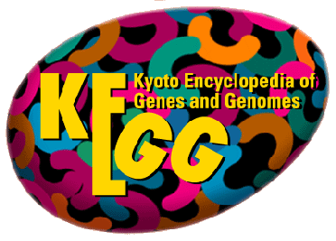

```{r meta, echo=FALSE}
library(metathis)
meta() %>%
  meta_general(
    description = "Intro",
    generator = "xaringan and remark.js"
  ) %>% 
  meta_name("github-repo" = "sandragodinhosilva/microbiomes2021") %>% 
  meta_social(
    title = "Intro",
    url = "https://sandragodinhosilva/microbiomes2021/slides/day-01-basics.html#1",
    image = "https://raw.githubusercontent.com/sandragodinhosilva/microbiomes2021/main/slides/day-01-cover-image.png",
    image_alt = "Title slide",
    og_type = "website",
    og_author = "Sandra Godinho Silva",
    twitter_card_type = "summary_large_image",
    twitter_creator = "@SandraGodSilva"
  )
```

```{r set-theme, include=FALSE}
library(xaringanthemer)
style_duo_accent(
  primary_color      = "#0F4C81", # pantone classic blue
  secondary_color    = "#B6CADA", # pantone baby blue
  header_font_google = google_font("Raleway"),
  text_font_google   = google_font("Raleway", "300", "300i"),
  code_font_google   = google_font("Source Code Pro"),
  text_font_size     = "25px"
)
```

```{r setup, include = FALSE}
options(htmltools.dir.version = FALSE)
library(knitr)
library(broom)
library(icons)
library(scales)
library(openintro)
library(jsonlite)
library(tidyverse)
library(xaringanExtra)
library(nhsrtheme)
library(NHSRdatasets)
# set default options
opts_chunk$set(echo=FALSE,
               collapse = TRUE,
               fig.width = 7.252,
               fig.height = 4,
               dpi = 300)
# set engines
knitr::knit_engines$set("markdown")
xaringanExtra::use_tile_view()
xaringanExtra::use_panelset()
xaringanExtra::use_clipboard()
xaringanExtra::use_webcam()
xaringanExtra::use_broadcast()
xaringanExtra::use_share_again()
xaringanExtra::style_share_again(
  share_buttons = c("twitter", "linkedin", "pocket")
)

```

class: title-slide,center,middle, top
background-image: url(img/jeremy-bishop-G9i_plbfDgk-unsplash.jpg)
background-position:  75% 75%
background-size: cover


# `r rmarkdown::metadata$title`
<br>

#### `r rmarkdown::metadata$subtitle`
<br>
**`r rmarkdown::metadata$author`**  
`r rmarkdown::metadata$institute`  
`r rmarkdown::metadata$date`  

.center[
.small[
.footnote[
<br><br>
.blue[Graphic by Jeremy Bishop] [@ Unsplash](https://unsplash.com/photos/G9i_plbfDgk)
]
]
]
---
name: about-me
class: center, middle

## About me: Sandra Godinho Silva


### PhD Student @ Institute for Bioengineering and Biosciences

.fade[Instituto Superior Técnico<br>Lisbon, Portugal]

[`r icons::fontawesome("orcid")` Orcid](https://orcid.org/0000-0002-4763-0662)
[`r icons::icon_style(icons::fontawesome("github"), scale = 1)` @sandragodinhosilva](https://github.com/sandragodinhosilva)

???
[`r icons::fontawesome("link")` sandragodinhosilva.netlify.com](https://sandragodinhosilva.netlify.com)
[`r icons::fontawesome("twitter")` @SandraGodSilva](https://twitter.com/SandraGodSilva)
---
background-image: url("img/jeremy-bishop-G9i_plbfDgk-unsplash.jpg")
background-position: 0% 75%
background-size: 25% 100%


class: middle
.right-column[
# Table of contents
* **Part 1:** [Bioinformatics: what are the tools available?](#part1)

* **Part2:** [Bioinformatic tools for Genome Annotation](#part2)

* **Hands-on 1:** [Annotate genomes with the COG database](#handson1)

> * **1.1:** [Rast-WebMGA workflow](#handson1)

> * **1.2:** [Join COG annotation with a R script](#handson2)
>> * **1.2.1:** [R Setup](https://sandragodinhosilva.github.io/microbiomes2021/pages/R_setup.html)
>> * **1.2.2:** [Get started with R and RStudio](https://sandragodinhosilva.github.io/microbiomes2021/pages/R_basics.html)
]
---

background-image: url("img/jeremy-bishop-G9i_plbfDgk-unsplash.jpg")
background-position: 0% 75%
background-size: 25% 100%

name: part1

class:  middle
.right-column[
# Part 1
### .blue[Bioinformatics: what are the tools available?]
]
---
class:  center, middle

# Bioinformatics
<br>
Bioinformatics is the science that conjugates  
**biology** + **statistics** + **computer sciences**  
to study biological issues through the analysis of data.

---
class: middle

**Bioinformatics is a constantly changing and updating field.**

Fast developments in:
> - software
- computing hardware 
- high throughput technologies 

--

are creating a significant bottleneck:  
**How to thoroughly analyze this massive amount of data?**

---
.center[**How to thoroughly analyze this massive amount of data?**]

```{r bigdata, echo=FALSE, out.width="70%", fig.align="center"}
knitr::include_graphics("img/bigdata_lifesciences.png")
```
.center[
.small[
[Stephens et a. PLoS Biology, 2015](https://journals.plos.org/plosbiology/article?id=10.1371/journal.pbio.1002195)
]]

---
## Integrative OMICS
```{r integrative, echo=FALSE, out.width="80%", fig.align="center"}

```
.center[
.small[[Yugi et al., Trends Biotechnol. 2016 Apr; 34(4):276–290](https://doi.org/10.1016/j.tibtech.2015.12.013)]
]

---
## Choose the most appropriate route for you

Nowadays, bioinformaticians and researchers working in life scientists can choose from an overwhelming collection of exciting technologies and programming languages.  

--

Several options:
> - [Web-based platforms](#Web-based)

--

> - [Scripting/programming](#scripting)

---
name: Web-based
## Web-based platforms

Allow **accessible**, **reproducible** and **transparent computational research.**

.panelset[

.panel[.panel-name[KBase]

.left-column[
```{r kbase, echo=FALSE, out.width="100%"}
knitr::include_graphics("img/KBase-logo.png")
```
]
.right-column[The U.S. Department of Energy Systems Biology Knowledgebase [KBase](https://www.kbase.us/)  is an open-source software and data platform designed to meet the grand challenge of systems biology — predicting and designing biological function from the biomolecular (small scale) to the ecological (large scale).  
[Kbase: https://www.kbase.us/](https://www.kbase.us/)
]]


.panel[.panel-name[Galaxy]
.left-column[
```{r galaxy, echo=FALSE, out.width="100%"}
knitr::include_graphics("img/galaxy.png")
```
]
.right-column[Galaxy provides a system that enables researchers without informatics expertise to perform computational analyses through the web. A user interacts with Galaxy through the web by uploading and analyzing the data. Galaxy interacts with underlying computational infrastructure (servers that run the analyses and disks that store the data) without exposing it to the user. 
[Galaxy project: https://galaxyproject.org/](https://galaxyproject.org/)
]]
]


---
name: scripting
# Scripting & programming

.panelset[

.panel[.panel-name[Bash]
.left-column[
```{r bash, echo=FALSE, out.width="100%"}

```
]
.right-column[
* Default login shell for most Linux distributions;
* Simple bash scripts are really useful for data manipulation.

<br><br>
```{r bashex, echo=FALSE, out.width="80%"}
knitr::include_graphics("img/bash_ex.png")
```
]
]

.panel[.panel-name[Python (1/2)]
.left-column[
```{r python, echo=FALSE, out.width="80%"}
knitr::include_graphics("img/python.png")
```
]
.right-column[
## Python
* Clear and powerful object-oriented programming language;
* Portable – runs just about anywhere;
* Clear syntax – relatively easy to learn.
Source: [https://www.python.org/](https://www.python.org)]
]

.panel[.panel-name[Python (2/2)]

.left-column[
```{r biopython, echo=FALSE, out.width="100%"}
knitr::include_graphics("img/Biopython_logo.svg")
```
]
.right-column[
## Biopython
* Collection of .blue[Python] modules that provide functions to deal with DNA, RNA & protein sequence operations;
* It has sibling projects like BioPerl, BioJava and BioRuby.  
Source: [https://biopython.org/](https://biopython.org)
]
]

.panel[.panel-name[R (1/3)]
.left-column[
```{r rlogo, echo=FALSE, out.width="100%"}
knitr::include_graphics("img/Rlogo.png")
```
]
.right-column[
## R
* .purple[R] is a powerful, popular open-source scripting language
* More than 20 years old - fairly mature - and growing in popularity. 
]
]

.panel[.panel-name[R (2/3)]
### Why is R so popular?
- **Statistical Language**: R is widely used in biology, genetics as well as in statistics. 

- **Vast array of packages**: With over 10,000 packages in the CRAN repository, the number is constantly growing. These packages appeal to all the areas of industry.

- **Quality Plotting and Graphing**: The popular libraries like ggplot2 and plotly advocate for aesthetic and visually appealing graphs that set R apart from other programming languages.
]
.panel[.panel-name[R (3/4)]


.left-column[**Dynamic graph:** 
ggplot2 + gganimate
<br><br>
Source: [link]()
]
.right-column[
```{r gif, echo=FALSE, out.width="50%", fig.align="center"}

```
]
]
.panel[.panel-name[R (4/4)]
.pull-left[
```{r rstudio, echo=FALSE, out.width="100%"}
knitr::include_graphics("img/rstudio.png")
```
]
.pull-right[
## R Studio
* Integrated Development Environment (IDE). 
* Provides a graphical interface to R, making it more user-friendly, and providing dozens of useful features.
.midi[Source: [https://www.rstudio.com/](https://www.rstudio.com/)
]
]

]
]

---
# And much more!

```{r programming, echo=FALSE, out.width="60%",fig.align = "center"}
knitr::include_graphics("img/programming_languages.jpeg")
```

---
background-image: url("img/jeremy-bishop-G9i_plbfDgk-unsplash.jpg")
background-position: 0% 75%
background-size: 25% 100%

name: part2

class:  middle
.right-column[
# Part 2
### .blue[Bioinformatic tools for Genome Annotation]
]
---
# Genome Annotation

The process of attaching biological information to sequences.  

<br>
**Consists of two main steps:** 
- .blue[structural annotation]: identifying genomic elements;

- .blue[functional annotation]: attaching biological information to these elements. 

<br>
```{r gn, echo=FALSE, out.width="70%",fig.align = "center"}
knitr::include_graphics("img/bioinformatics_03_annotation_yourgenome.png")
```
.center[.small[
Source: [link](https://zhiganglu.com/post/annotation-pipeline-tools/)]
]
???
Gene annotation is the plotting of genes onto genome assemblies, and indexing their genomic coordinates.
DNA annotation or genome annotation is the process of identifying the locations of genes and all of the coding regions in a genome and determining what those genes do.

* Once a genome is sequenced, all of the sequences must be analyzed to understand what their meaning.

* Critical to annotation is the identification of the genes in a genome, the structure of the genes, and the proteins they encode.

* Once a genome is annotated, further work is done to understand how all the annotated regions interact with each other.


---
```{r elixir, echo=FALSE, out.width="100%", fig.align="center"}

```
 
---
```{r genome_annot, echo=FALSE, out.width="70%", fig.align="center", fig.cap="Source: https://www.ssbs.edu.in/genome-annotation.htm"}

```

???
Genome Annotation is the process to identify, analyze and interpret the relevant information related to the raw DNA sequences. Genome Annotation helps to extract structural location and biological functions of genes. Haemophilus influenza was the first free-living bacterium to be decoded in 1995 by Dr. Owen White. The assembling of the quality reads with a reference genome or de novo assembly in order to obtain the complete genome is a primary requirement for Genome Annotation.

---
# Structural Annotation
The process of identifying genomic elements such as: 
> * open reading frames (ORFs) and their localization;
* gene structure;
* coding regions;
* regulatory motifs.


```{r gene_structure, echo=FALSE, out.width="50%", fig.align="center"}

```
.center[
.small[Prokaryotic and Eukaryotic gene structure. 
Source: [link](https://www.researchgate.net/publication/266155655_Accurate_RNA-seq_based_de_novo_annotation_using_mGenengs)
]
]


???
identifying the positions of structural
genomic elements, like genes, exons, introns, repeated regions, promoters, etc
---
## Structural Annotation: Methods
.pull-left[
* **Similarity**  
Similarity between sequences 
<br><br>
```{r sim, echo=FALSE, out.width="70%", fig.align="center"}

```
]
.pull-right[* ***ab-initio* prediction**  
Genes are predicted based on gene content and signal detection (e.g. start/stop codon; Ribosome Biding Site (RBS), etc.).
```{r ab, echo=FALSE, out.width="60%", fig.align="center"}

```
]
???
In another words, they predict genes by analyzing statistical features of genes first, then separate the coding sequences and non-coding sequences apart.

What? Prediction of complete or truncated genes from metagenomic / genomic  contigs / reads
How? Many algorithms available – most commonly used: glimmer and prodigal Goal: find most likely start and stop codons across sequences
Typically quick to run
Metagenomic contigs add complexity (spurious contigs, variable  codon usage, etc.)


---
### Examples of *ab-initio* tools: 
* Glimmer
* GenemarkHMM 
<br>
--
<br>
* .huge[**PRODIGAL**]  
**PROkaryotic DYnamic programming Gene-finding ALgorithm**

> - Predicts protein-coding genes 
- Handles gaps and partial genes
- Identifies translation initiation sites
- Handles finished genomes, draft genomes and metagenomes.
- Runs quickly
- Runs unsupervised: is an **unsupervised machine learning algorithm**.  
Automatically learns the properties of the genome from the sequence itself, including RBS motif usage, start codon usage, and coding statistics.  
- Source: [https://github.com/hyattpd/Prodigal](https://github.com/hyattpd/Prodigal)
---
# Functional Annotation

The process of **attaching biological information to genomic elements** by describing the biochemical and biological function of proteins. 

Possible analysis:
> - similarity searches;
- gene cluster prediction for secondary metabolites;
- identification of transmembrane domains in protein sequences;
- finding gene ontology terms;
- pathway information.

Functional roles are assigned to coding sequences (CDSs).


???
What? Queries databases with genes predicted previously
Many tools available. Most commonly used:
HMMer - Search sequence databases with Hidden Markov Models
BLAST - Basic Local Alignment Search Tool


Huge in number - some more generic, some more specialized
Most popular: COGs, Pfams, InterPro (more recent), KEGG
Package of databases used will delineate the workload in metagenome/genome processing
Some current annotation pipelines work as “wrappers” which will join information from several databases (e.g. Prokka)


---
## Functional Assignment Databases
**NCBI Nucleotide and Proteins databases**  
NCBI hosts constantly updated databases of proteins and DNA from several sources that include most of the newly sequenced organisms.

Queries to this database can be performed through the BLAST web server, also hosted by the NCBI.

.citation[BLAST can be considered the basic level of annotation for finding similarities.
]
---
**BLAST (Basic Local Alignment Search Tool)**  

BLAST finds regions of similarity between biological sequences. The program compares nucleotide or protein sequences to sequence databases and calculates the statistical significance.

```{r blast, echo=FALSE, out.width="55%", fig.align="center"}

```

???
Widely used sequence similarity search tool

Find high scoring local alignments between two sequences

Includes a model of score distributions for random local alignments

Provides statistical significance for alignments

Mostly used for 

I have a Dna or protein sequences
1. What is it related to? What does it do? (Homology, Conseerved Domains)
2. Is is already in the database? (Identification)
3. Where is it located or how is it organized? (Annotation, Assembly)

---
## Databases
**Specialist databases**  
Some databases offer extra information and search criteria for specific fields of study, while usually including the sequences already in public databases such as NCBI.

???
Some databases use genome context information, similarity scores, experimental data, and integrations of other resources to provide genome annotations through their Subsystems approach. Other databases rely on both curated data sources as well as a range of different software tools in their automated genome annotation pipeline.
---
## Databases
**Specialist databases**  
.panelset[
.panel[.panel-name[PFAM]
.left-column[
.center[
```{r pfam, echo=FALSE, out.width="100%", fig.align="center"}
knitr::include_graphics("img/pfam.gif")
```
]
]
.right-column[
Pfam is a large collection of protein families, represented by multiple sequence alignments and hidden Markov models (HMMs).  
Source: [http://pfam.xfam.org/](http://pfam.xfam.org/)
]
]

.panel[.panel-name[COG]
.left-column[
# COG
]
.right-column[
**Clusters of Orthologous Groups (COGs)**  
Database of proteins generated by comparing the protein sequences of complete genomes.  
Each COG consists of individual orthologous proteins or orthologous sets of paralogs from at
least 3 lineages.  
Orthologs typically have the same function, allowing transfer of functional information from one member to an entire COG.  
Source: [https://www.ncbi.nlm.nih.gov/research/cog-project/](https://www.ncbi.nlm.nih.gov/research/cog-project/)
]
]

.panel[.panel-name[Kegg]
.left-column[
```{r kegg, echo=FALSE, out.width="100%"}

```
]
.right-column[
**Kyoto Encyclopedia of Genes and Genomes**  
Database resource for understanding high-level functions and utilities of biological systems, such as the cell, the organism and the ecosystem, from molecular-level information.  
Source: [https://www.genome.jp/kegg/](https://www.genome.jp/kegg/)
]
]

.panel[.panel-name[CAZymes]
.left-column[
```{r cazymes, echo=FALSE, out.width="150%"}

```
]
.right-column[
**Carbohydrate-Active enZymes**  
Enzymes involved in the synthesis, metabolism, and transport of carbohydrates.  
CAZymes are organized in families in the continuously updated database [CAZy](www.cazy.org).  
Source: [http://www.cazy.org/](http://www.cazy.org/)
???
Includes: glycoside hydrolases (GHs), glycosyltransferases (GTs), polysaccharide lyases (PLs), carbohydrate esterases (CEs) and carbohydrate binding modules (CBMs). 
]
]

]
---
```{r performance, echo=FALSE, out.width="150%"}

```

.center[
.small[Prakash, Tulika & Taylor, Todd. (2012). Functional assignment of metagenomic data: Challenges and applications.
<br>
Briefings in bioinformatics. 10.1093/bib/bbs033. 
[(link)](https://academic.oup.com/bib/article/13/6/711/193165)
]
]

---
## Genome annotation tools

### Functional assignment workflows
* **Prokaryotic Genomes Automatic Annotation Pipeline** (via NCBI) 

* **InterPro**

* **Prokka**  
Coomand-line tool.Also integrated into K-Base.


* **RAST**  
A web server for annotating bacterial and archaeal genomes that provides annotation results in under a day 
<br>

---


.pull-left[
```{r interpro, echo=FALSE, out.width="70%", fig.align="center"}

```
]
.pull-right[
## InterPro
Initial quality control

Identification of rRNA reads 

Binning of 16S rRNA gene reads

QIIME-based taxonomic assignment

Non-RNA reads: ORF prediction

Functional annotation with  
**InterPro (IPR) Scan**
***
Integrates several other databases  
**Updated every 8 weeks**


]


---

## PROKKA
**The approach:**  
Prokka uses a **variety of databases** to **assign function to predicted CDS features**.  
It takes a hierarchical approach to make it fast.  
<br>
--
**Proteins coding genes are annotated in two stages:**  
>**1)** **Prodigal** identifies the coordinates of candidate genes, but does not describe the putative gene product.


>**2.1)** A small, core set of well characterized proteins are first searched using **BLAST+**. This combination of small database and fast search typically completes about 70% of the workload. 

>**2.2)** A series of slower but more sensitive HMM databases are searched using **HMMER3**.

<br>
.small[
[Tutorial: https://training.galaxyproject.org/training-material/topics/genome-annotation/tutorials/annotation-with-prokka/tutorial.html](https://training.galaxyproject.org/training-material/topics/genome-annotation/tutorials/annotation-with-prokka/tutorial.html)
]
???
Feature prediction tools used by Prokka
# | Tool (reference)| Features predicted|
# |------------:|-----------:|
# | Prodigal| 	Coding sequence (CDS)|
# | RNAmmer| Ribosomal RNA genes (rRNA)|
# | Aragorn| Transfer RNA genes|
# | SignalP|	Signal leader peptides|
# | Infernal| Non-coding RNA|

Automatic annotation tools try to perform all of this by computer analysis, as opposed to manual annotation (a.k.a. curation) which involves human expertise. Ideally, these approaches co-exist and complement each other in the same annotation pipeline (process). 
The basic level of annotation is using BLAST for finding similarities, and then annotating genomes based on that. However, nowadays more and more additional information is added to the annotation platform. The additional information allows manual annotators to deconvolute discrepancies between genes that are given the same annotation. 


https://bio.libretexts.org/Bookshelves/Microbiology/Book%3A_Microbiology_(Boundless)/7%3A_Microbial_Genetics/7.13%3A_Bioinformatics/7.13B%3A_Annotating_Genomes


Many of these features can be automatically predicted by sophisticated software packages based on sequence or structure comparisons.

Beyond this point, it is the goal and the job of a community annotation to generate accurate lists of the most crucial and interesting genes from a new genome, with raw data in the form of gene predictions with numbers attached, gaps in the draft genome sequence, and transcriptome alignments. In short, the goal at this point, is to convert the raw, machine generated data into a useable and useful data resource that will advance research in new, powerful and exciting directions.

---

.pull-left[
```{r rasttk, echo=FALSE, out.width="50%", fig.align="center"}

```
]
.pull-right[
## Rast
The new RAST-tk annotation pipeline

Very unique “Package” which works with its own database (SEED)
 and anotation scheme (“subsystems technology”).
]

---
## Take-home messages: .blue[Genome Annotation]
<br> 
### What?  
Attributes functions to genes predicted from genomes or metagenomes
### Why?  
To answer the “What do they do?” question
### How? 
Through the pipeline ORF/Gene calling – Database search – functional analytics

---
## Take-home messages: .blue[Genome Annotation]
<br> 
**Ideally:** Annotation of **all available/acquirable genes** to provide functional overview and hints on possible novel genes

<br>

**The annotation accuracy is only as good as the available supporting data!**

As new data becomes available, gene predictions and functional assignments will change.  
Ex: Characterization of hypotetical proteins
---
## Introduction to File Formats
.panelset[

.panel[.panel-name[FASTA]

DNA and protein sequences can be written in FASTA format.
First line:">" followed by the description. 
In the second line the sequence starts.

```{r fasta, echo=FALSE, out.width="50%",fig.align = "center"}

```

]

.panel[.panel-name[GFF3]

General feature format (gene-finding format, generic feature format, GFF) is a file format used for describing genes and other features of DNA, RNA and protein sequences.

```{r gff3, echo=FALSE, out.width="70%",fig.align = "center"}
knitr::include_graphics("img/gff3_format.png")
```
]


.panel[.panel-name[GENBANK]

The genbank sequence format is a rich format for storing sequences and associated annotations.

```{r genbank, echo=FALSE, out.width="50%",fig.align = "center"}
knitr::include_graphics("img/gb_full.png")
```

]
]
???
Source: https://training.galaxyproject.org/training-material/topics/genome-annotation/tutorials/genome-annotation/tutorial.html

---
background-image: url("img/jeremy-bishop-G9i_plbfDgk-unsplash.jpg")
background-position: 0% 75%
background-size: 25% 100%

name: handson1

class:  middle
.right-column[
# Hands-on 1
<br>
### .blue[Genome annotation with the]   
### .blue[Clusters of Orthologous Genes (COG) Database]
]

---
# Worflow

**Genome annotation with Clusters of Orthologous Genes (COG) Databa**

**K-Base**  
1) Download bins from K-Base in fasta format

**Rast**  
2) Upload bins in Rast  
3) Perform gene annotation  
4) Download fasta aminoacid files  

**WebMGA**  
5) Upload downloaded bins in WebMGA   
6) Perform COG annotation  
7) Download COG annotation from WebMGA  

**R**  
8) Join COG annotation into single table - R script

---
## K-Base  
<br>
--
1) Download bins from K-Base in fasta format


---
## Rast  
<br>
--
2) Upload bins in Rast  
<br>
--
3) Perform gene annotation   
<br>
--
4) Download fasta aminoacid files  

---
## WebMGA  

--
5) Upload downloaded bins in WebMGA    
<br>
--
6) Perform COG annotation   
<br>
--
7) Download COG annotation from WebMGA   
<br>
---

# WebMGA
```{r webmga, echo=FALSE, out.width="55%", fig.align="center"}
knitr::include_graphics("img/webmga_pfam.png")
```
[Link](http://weizhong-lab.ucsd.edu/webMGA/server/)


---
background-image: url("img/jeremy-bishop-G9i_plbfDgk-unsplash.jpg")
background-position: 0% 75%
background-size: 25% 100%

name: handson1.2

class:  middle
.right-column[
# Hands-on 1.2
### .blue[Install R and RStudio]  
**Link:** [R setup](https://sandragodinhosilva.github.io/microbiomes2021/pages/R_setup.html)


### .blue[Introduction to R and RStudio]
**Link:** [Getting started with R](https://sandragodinhosilva.github.io/microbiomes2021/pages/R_basics.html)
]


---
## R script to join annotations from different MAGs
<br>

**Download script:** 
.small[https://raw.githubusercontent.com/sandragodinhosilva/microbiomes2021/main/pages/data/Script_Merge_COGs.R
]
<br>

Note R extension!
---
class: center, middle

## That is all for today!
**Any questions?**

---
background-image: url("img/jeremy-bishop-G9i_plbfDgk-unsplash.jpg")
background-position: 0% 75%
background-size: 25% 100%

name: part1

class:  middle
.right-column[


# Thank you!

### Here's where you can find me...

.left[
[`r icons::fontawesome("link")` sandragodinhosilva.netlify.com](https://sandragodinhosilva.netlify.com) <br>
[`r icons::fontawesome("twitter")` @SandraGodSilva](https://twitter.com/SandraGodSilva)

.left[Slides created via the R package [**xaringan**](https://github.com/yihui/xaringan)]
]]


???
Unused
Some considerations about Homologs, Orthologs, and Paralogs

* **Homologous gene** (homolog): **a gene inherited in two species by a common ancestor**.  

<br>

```{r homologs, echo=FALSE, out.width="70%", fig.align="center"}
knitr::include_graphics("img/zinc-finger-seq-alignment2.png")
```

<br>
Homologous DNA: sequence alignment of a homologous protein from two different species.  The “*” represents a conserved amino acid in the two proteins. Figure: [link](https://s3-us-west-2.amazonaws.com/courses-images/wp-content/uploads/sites/1950/2017/05/31184035/zinc-finger-seq-alignment2.png)


class: middle
```{r homology, echo=FALSE, out.width="50%", fig.align="center"}
knitr::include_graphics("img/Homology.png")
```
.small[
.center[
Photo courtesy of:  Popo H. Liao, via Wikimedia Commons. Source: [link](https://bitesizebio.com/26762/homology-terminology-never-say-wrong-word/)
]
]

class: middle
While homologous genes can be similar in sequence, similar sequences are not necessarily homologous.
* **Orthologous** are homologous genes where a gene diverges after a speciation event, but the gene and its main function are conserved.

* If a gene is duplicated in a species, the resulting duplicated genes are **paralogs** of each other, even though over time they might become different in sequence composition and function.


???
Homology forms the basis of organization for comparative biology.
A homologous trait is often called a homolog (also spelled homologue). In genetics, the term “homolog” is used both to refer to a homologous protein and to the gene ( DNA sequence) encoding it. 

As with anatomical structures, homology between protein or DNA sequences is defined in terms of shared ancestry. 

Two segments of DNA can have shared ancestry because of either:
* a speciation event (orthologs) 
* duplication event (paralogs). 

Homology among proteins or DNA is often incorrectly concluded on the basis of sequence similarity. The terms “percent homology” and “sequence similarity” are often used interchangeably. As with anatomical structures, high sequence similarity might occur because of convergent evolution, or, as with shorter sequences, because of chance. Such sequences are similar, but not homologous. Sequence regions that are homologous are also called conserved. This is not to be confused with conservation in amino acid sequences in which the amino acid at a specific position has been substituted with a different one with functionally equivalent physicochemical properties. One can, however, refer to partial homology where a fraction of the sequences compared (are presumed to) share descent, while the rest does not. For example, partial homology may result from a gene fusion event.

