---

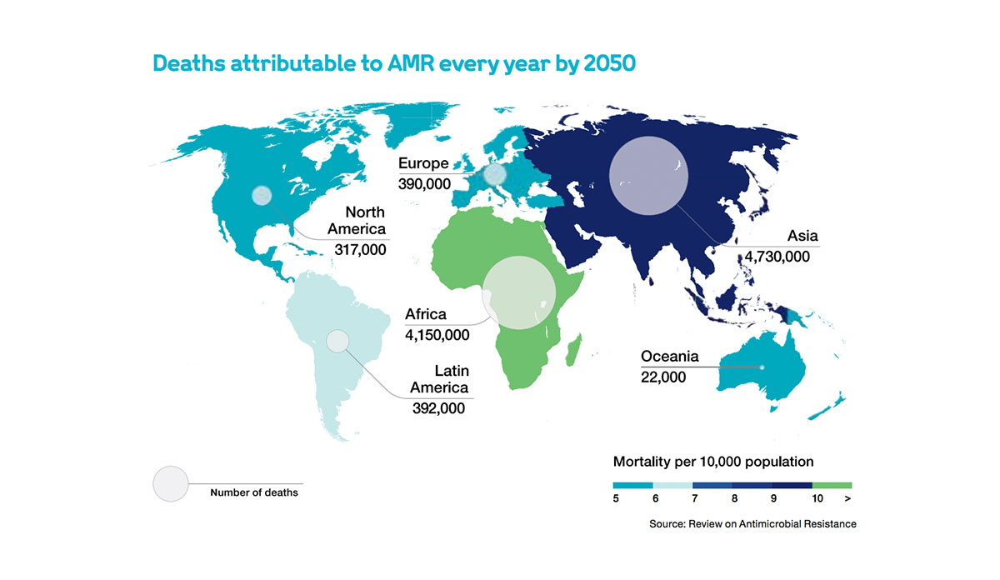


---


---


---

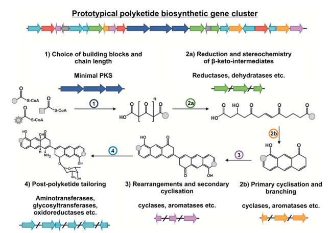


---

.pull-left[]

.pull-right[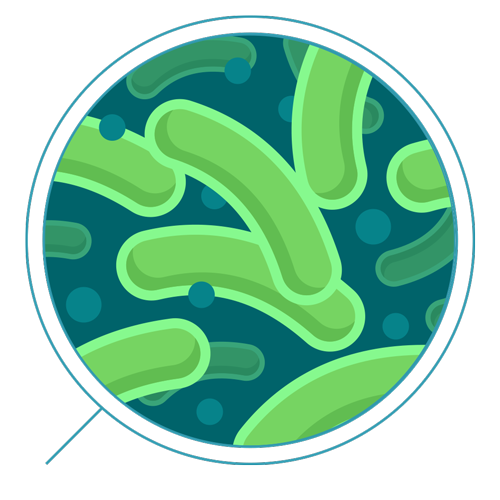]


---


---
class: inverse
background-image: url('assets/img/image12.png')
background-size: cover


---
class: inverse
background-image: url('assets/img/image14.wmf')
background-size: cover


---
class: inverse
background-image: url('assets/img/image10.png')
background-size: cover


---
class: inverse
background-image: url('assets/img/image13.png')
background-size: cover


---


---
class: inverse
background-image: url('assets/img/image19.wmf')
background-size: cover


---
class: inverse
background-image: url('assets/img/image15.wmf')
background-size: cover


---
class: inverse
background-image: url('assets/img/image14.wmf')
background-size: cover


---
class: inverse
background-image: url('assets/img/image18.wmf')
background-size: cover


---
class: inverse
background-image: url('assets/img/image17.wmf')
background-size: cover


---
class: inverse
background-image: url('assets/img/image16.wmf')
background-size: cover


---


---
class: inverse
background-image: url('assets/img/image25.png')
background-size: cover


---
class: inverse
background-image: url('assets/img/image20.png')
background-size: cover


---
class: inverse
background-image: url('assets/img/image24.png')
background-size: cover


---
class: inverse
background-image: url('assets/img/image23.png')
background-size: cover


---
class: inverse
background-image: url('assets/img/image22.png')
background-size: cover


---
class: inverse
background-image: url('assets/img/image21.png')
background-size: cover


---


---
class: inverse
background-image: url('assets/img/image31.wmf')
background-size: cover


---
class: inverse
background-image: url('assets/img/image36.wmf')
background-size: cover


---
class: inverse
background-image: url('assets/img/image26.wmf')
background-size: cover


---
class: inverse
background-image: url('assets/img/image30.wmf')
background-size: cover


---
class: inverse
background-image: url('assets/img/image35.wmf')
background-size: cover


---
class: inverse
background-image: url('assets/img/image29.wmf')
background-size: cover


---
class: inverse
background-image: url('assets/img/image34.wmf')
background-size: cover


---
class: inverse
background-image: url('assets/img/image28.wmf')
background-size: cover


---
class: inverse
background-image: url('assets/img/image33.wmf')
background-size: cover


---
class: inverse
background-image: url('assets/img/image27.wmf')
background-size: cover


---
class: inverse
background-image: url('assets/img/image32.wmf')
background-size: cover


---
class: inverse
background-image: url('assets/img/image37.wmf')
background-size: cover


---

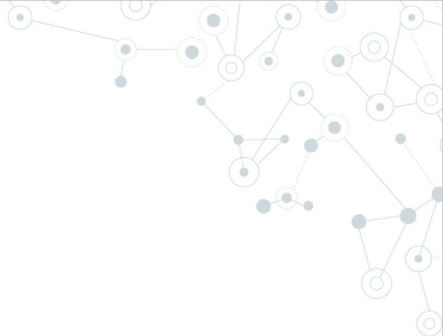


---


---


---
class: inverse
background-image: url('assets/img/image39.png')
background-size: cover


---
class: inverse
background-image: url('assets/img/image41.jpeg')
background-size: cover


---
class: inverse
background-image: url('assets/img/image40.png')
background-size: cover


---


---
class: inverse
background-image: url('assets/img/image35.wmf')
background-size: cover


---
class: inverse
background-image: url('assets/img/image39.png')
background-size: cover


---
class: inverse
background-image: url('assets/img/image37.wmf')
background-size: cover


---
class: inverse
background-image: url('assets/img/image34.wmf')
background-size: cover


---
class: inverse
background-image: url('assets/img/image29.wmf')
background-size: cover


---
class: inverse
background-image: url('assets/img/image40.png')
background-size: cover


---
class: inverse
background-image: url('assets/img/image36.wmf')
background-size: cover


---


---
class: inverse
background-image: url('assets/img/image42.png')
background-size: cover


---
class: inverse
background-image: url('assets/img/image39.png')
background-size: cover


---
class: inverse
background-image: url('assets/img/image40.png')
background-size: cover


---
class: inverse
background-image: url('assets/img/image13.png')
background-size: cover


---

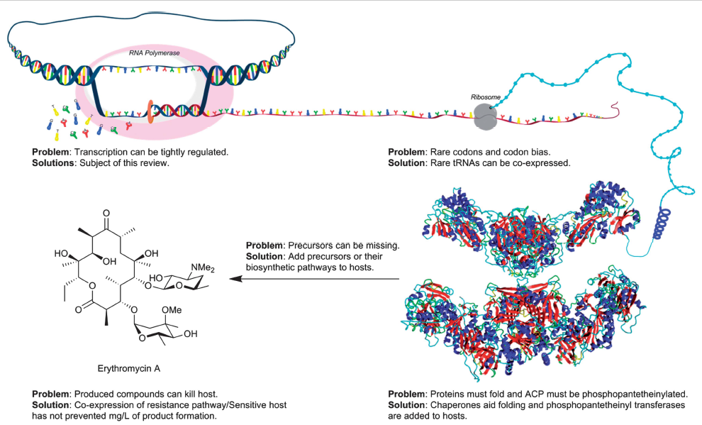


---


---
class: inverse
background-image: url('assets/img/image40.png')
background-size: cover


---
class: inverse
background-image: url('assets/img/image45.png')
background-size: cover


---
class: inverse
background-image: url('assets/img/image44.png')
background-size: cover


---


---
class: inverse
background-image: url('assets/img/image46.jpeg')
background-size: cover


---
class: inverse
background-image: url('assets/img/image49.jpeg')
background-size: cover


---
class: inverse
background-image: url('assets/img/image48.png')
background-size: cover


---
class: inverse
background-image: url('assets/img/image47.png')
background-size: cover


---
class: inverse
background-image: url('assets/img/image13.png')
background-size: cover


---

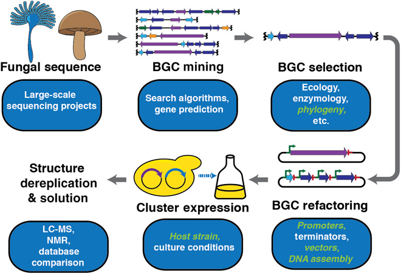


---

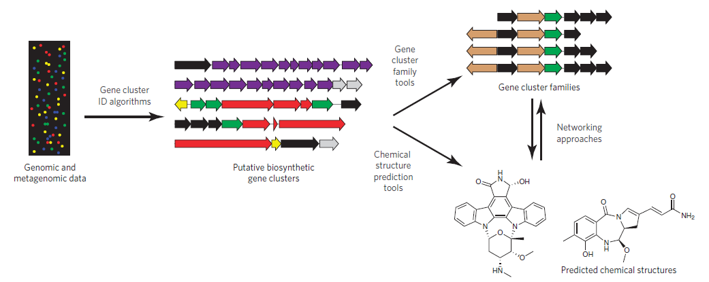


---


---
class: inverse
background-image: url('assets/img/image6.png')
background-size: cover


---
class: inverse
background-image: url('assets/img/image44.png')
background-size: cover


---
class: inverse
background-image: url('assets/img/image13.png')
background-size: cover


---
class: inverse
background-image: url('assets/img/image52.png')
background-size: cover


---


---


---


---

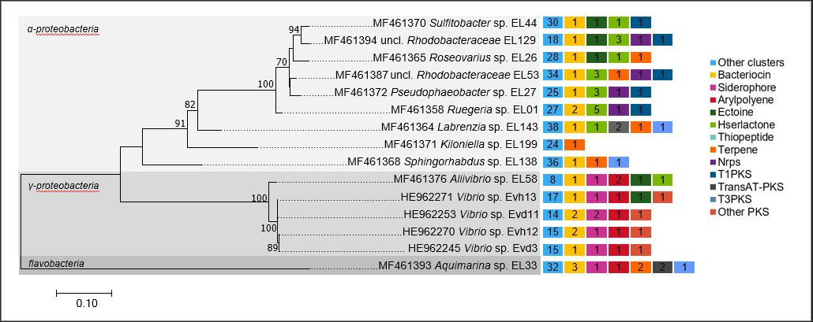


---


---


---

.pull-left[]

.pull-right[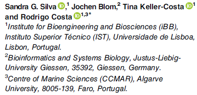]


---


---
class: inverse
background-image: url('assets/img/image57.jpeg')
background-size: cover


---
class: inverse
background-image: url('assets/img/image61.jpeg')
background-size: cover


---
class: inverse
background-image: url('assets/img/image60.jpeg')
background-size: cover


---
class: inverse
background-image: url('assets/img/image59.jpeg')
background-size: cover


---
class: inverse
background-image: url('assets/img/image58.jpeg')
background-size: cover


---


---
class: inverse
background-image: url('assets/img/image62.png')
background-size: cover


---
class: inverse
background-image: url('assets/img/image66.png')
background-size: cover


---
class: inverse
background-image: url('assets/img/image65.png')
background-size: cover


---
class: inverse
background-image: url('assets/img/image64.png')
background-size: cover


---
class: inverse
background-image: url('assets/img/image63.png')
background-size: cover


---


---
class: inverse
background-image: url('assets/img/image65.png')
background-size: cover


---
class: inverse
background-image: url('assets/img/image67.png')
background-size: cover


---
class: inverse
background-image: url('assets/img/image64.png')
background-size: cover


---
class: inverse
background-image: url('assets/img/image63.png')
background-size: cover


---
class: inverse
background-image: url('assets/img/image69.png')
background-size: cover


---
class: inverse
background-image: url('assets/img/image70.png')
background-size: cover


---
class: inverse
background-image: url('assets/img/image68.png')
background-size: cover


---
class: inverse
background-image: url('assets/img/image66.png')
background-size: cover


---

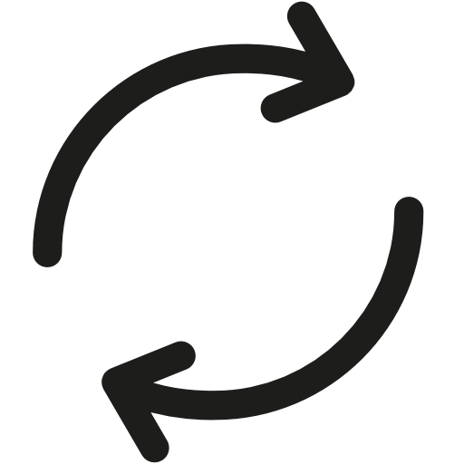


---


---

.pull-left[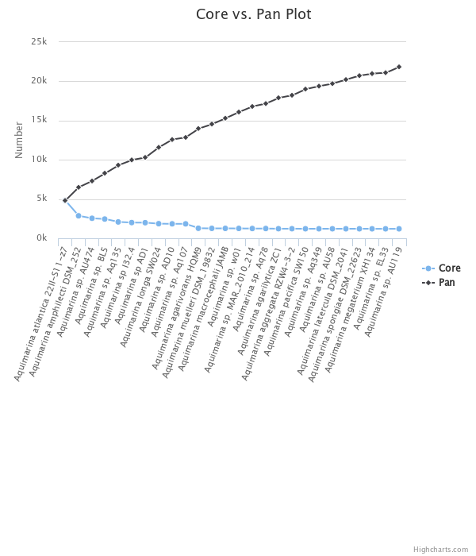]

.pull-right[]


---


```{r tbl35, echo = FALSE}
tbl35 <- tibble::tribble(
~`2320`, ~`Number of different ORFs`, ~` `, ~`4187`,
"1024","Core  (Nr. ORFs present in all strains)"," ","1130",
"248","Unique (Nr. of ORFs only present in one strain)"," ","1716",
"87646","Total number of ORFs"," ","242234",
"3371","Average of number of ORFs per strain"," ","9317"
)

kableExtra::kable_styling(knitr::kable(tbl35), font_size = 18)
```


---

.pull-left[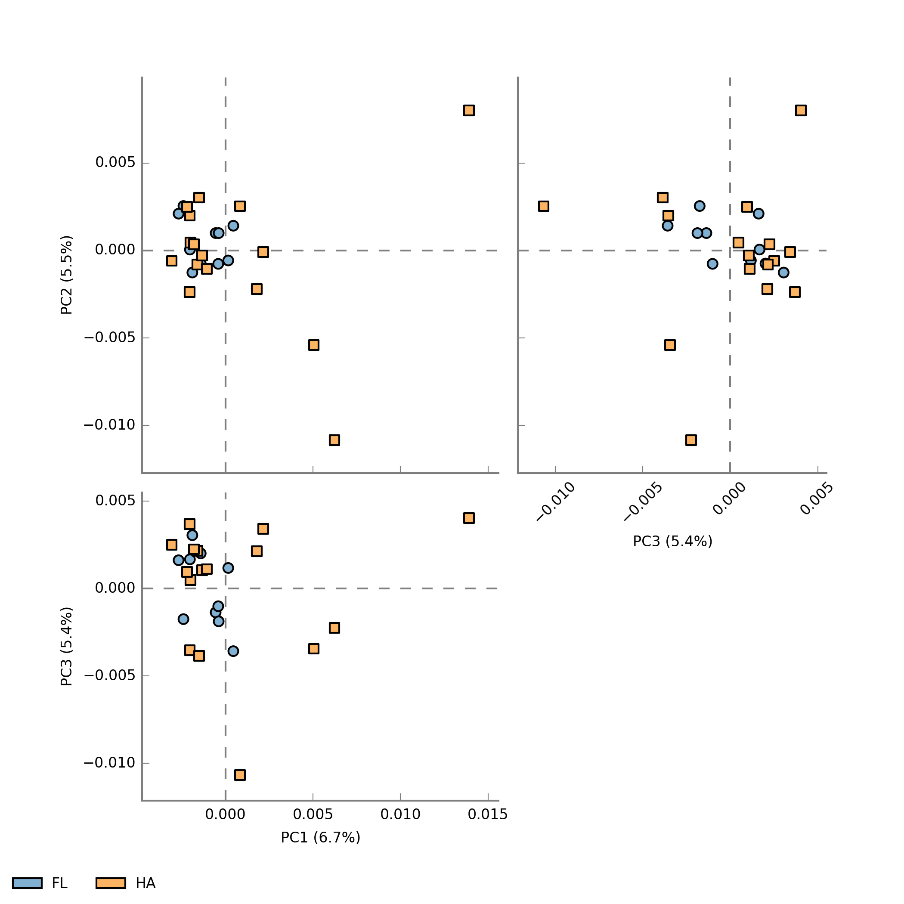]

.pull-right[]


---

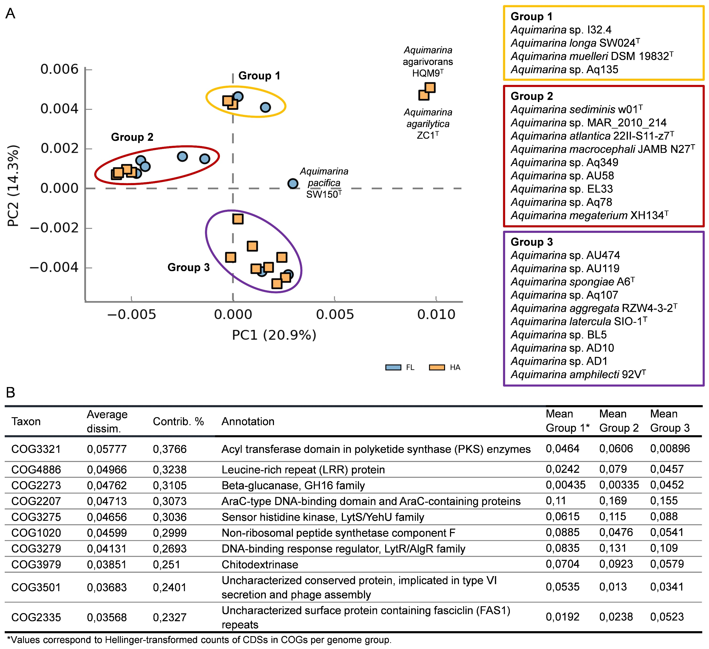


---

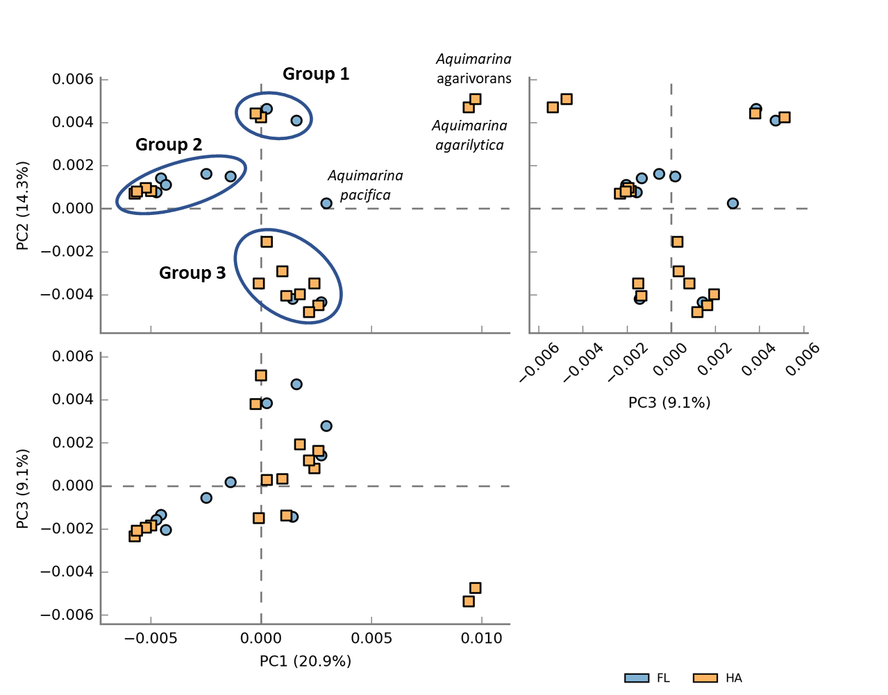


---


```{r tbl39, echo = FALSE}
tbl39 <- tibble::tribble(
~`Taxon`, ~`Av. dissim`, ~`Contrib. %`, ~`Annotation`,
"COG3321","0,05777","0,3766","Acyl transferase domain in polyketide synthase (PKS) enzymes",
"COG4886","0,04966","0,3238","Leucine-rich repeat (LRR) protein",
"COG2273","0,04762","0,3105","Beta-glucanase, GH16 family",
"COG2207","0,04713","0,3073","AraC-type DNA-binding domain and AraC-containing proteins",
"COG3275","0,04656","0,3036","Sensor histidine kinase, LytS/YehU family",
"COG1020","0,04599","0,2999","Non-ribosomal peptide synthetase component F",
"COG3279","0,04131","0,2693","DNA-binding response regulator, LytR/AlgR family",
"COG3979","0,03851","0,251","Chitodextrinase",
"COG3501","0,03683","0,2401","Uncharacterized conserved protein, implicated in type VI secretion and phage assembly",
"COG2335","0,03568","0,2327","Uncharacterized surface protein containing fasciclin (FAS1) repeats"
)

kableExtra::kable_styling(knitr::kable(tbl39), font_size = 18)
```


---

.pull-left[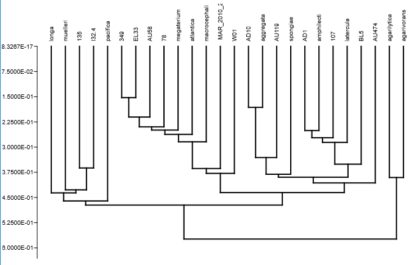]

.pull-right[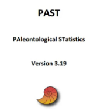]


---

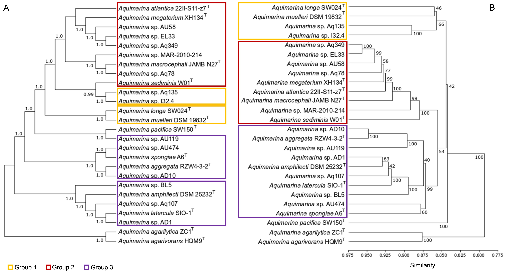


---

.pull-left[]

.pull-right[]


---

.pull-left[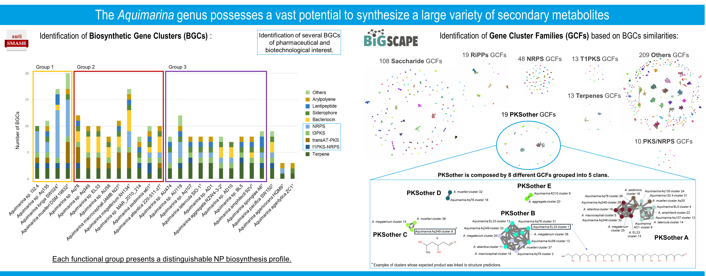]

.pull-right[]


---


---
class: inverse
background-image: url('assets/img/image83.png')
background-size: cover


---
class: inverse
background-image: url('assets/img/image84.png')
background-size: cover


---
class: inverse
background-image: url('assets/img/image69.png')
background-size: cover


---


---
class: inverse
background-image: url('assets/img/image83.png')
background-size: cover


---
class: inverse
background-image: url('assets/img/image86.wmf')
background-size: cover


---
class: inverse
background-image: url('assets/img/image85.png')
background-size: cover


---
class: inverse
background-image: url('assets/img/image69.png')
background-size: cover


---


---


---


---
class: inverse
background-image: url('assets/img/image89.png')
background-size: cover


---
class: inverse
background-image: url('assets/img/image88.png')
background-size: cover


---
class: inverse
background-image: url('assets/img/image90.jpeg')
background-size: cover


---

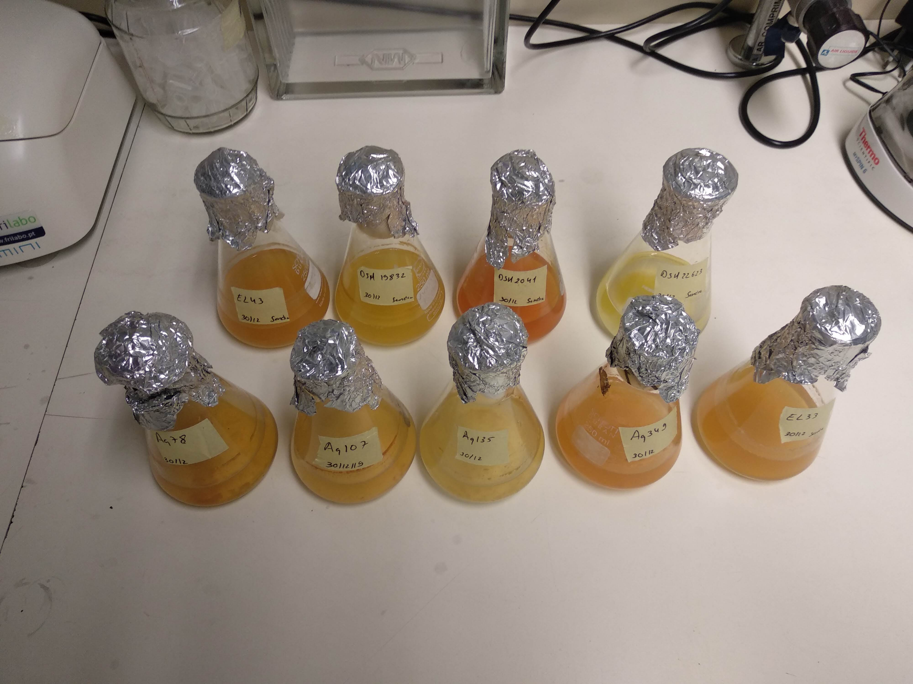


---


---


---


```{r tbl52, echo = FALSE}
tbl52 <- tibble::tribble(
~` `, ~`Vibro spp.`, ~` `, ~` `, ~` `, ~` `, ~` `, ~` `, ~` `, ~`Vibrio schiloi`, ~`Micrococcus sp. MC110`, ~`Pseudovibrio sp. Pv125`, ~`Labrenzia sp. EL143`,
" ","EL22","EL36","EL38","EL41","EL49","EL62","EL67","EL112"," "," "," "," ",
"A. muelleri DSM19832","+++","++","++","+++","+++","++","+++","+++","-","-","+++","++",
"A. latercula DSM2041","-","-","-","+++","-","-","-","-","-","-","-","-",
"A. spongiae DSM22623 ","-","-","-","-","-","-","-","-","-","-","-","-",
"Aquimarina sp. Aq78","+","-","+","+++","-","+","++","+","-","-","+","-",
"Aquimarina sp. Aq107","+","-","+","+++","-","+","+","++","-","-","-","-",
"Aquimarina sp. Aq135","-","-","+","+++","+","-","++","+","-","-","++","++",
"Aquimarina sp. Aq349","++","-","+","+++","-","+","++","++","-","-","+","-",
"Aquimarina sp. EL33","++","-","++","+++","-","+","++","++","-","-","+","-",
"Aquimarina sp. EL43","++","-","+","+++","-","+","++","++","-","-","-","-",
"Growth inhibition","+++","++","+","+/-","-",NA,NA,NA,NA,NA,NA,NA,
" ","100%","75%","50%","25%","0%",NA,NA,NA,NA,NA,NA,NA
)

kableExtra::kable_styling(knitr::kable(tbl52), font_size = 18)
```
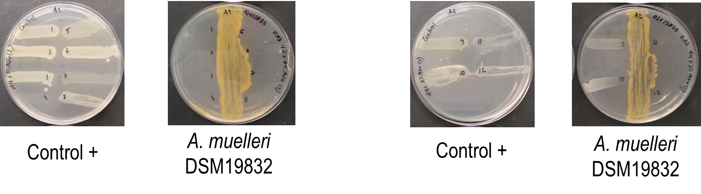


---

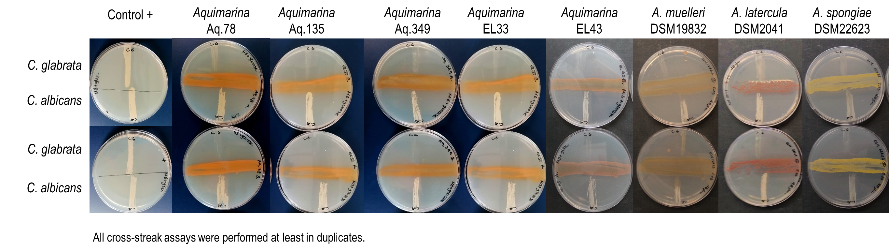


---


---


---


---

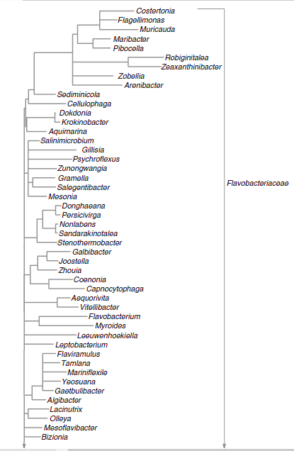


---


---


---


---
class: inverse
background-image: url('assets/img/image97.jpeg')
background-size: cover


---
class: inverse
background-image: url('assets/img/image99.png')
background-size: cover


---
class: inverse
background-image: url('assets/img/image98.png')
background-size: cover


---


---

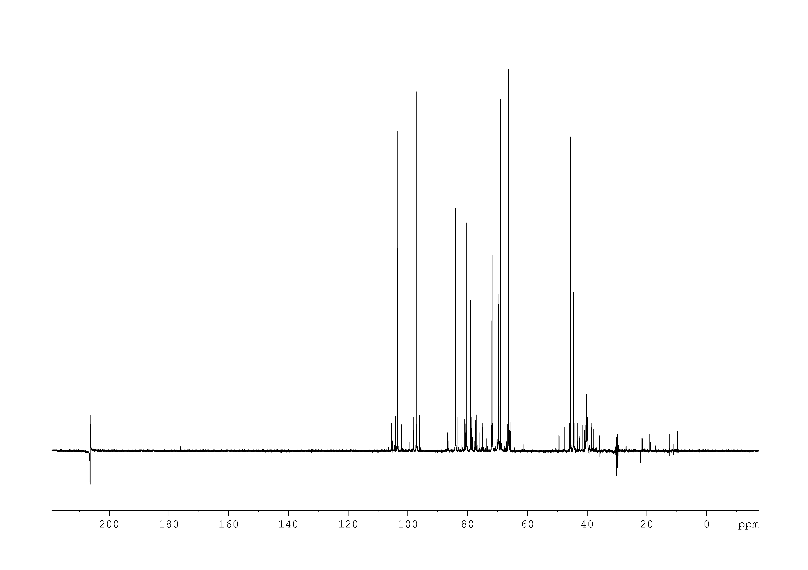


---

.pull-left[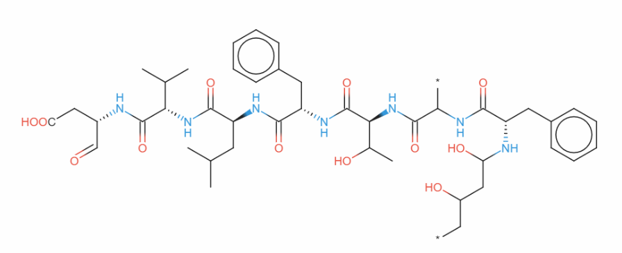]

.pull-right[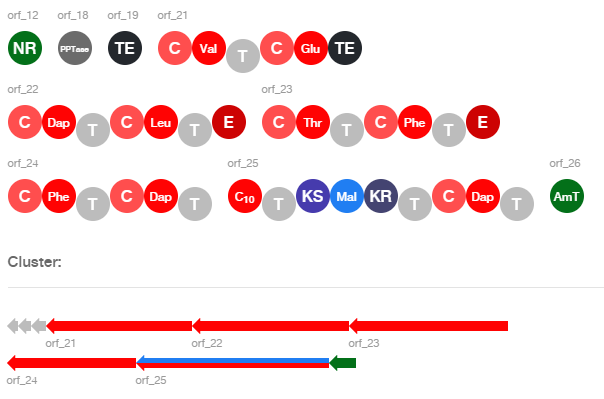]


---


---
class: inverse
background-image: url('assets/img/image103.png')
background-size: cover


---
class: inverse
background-image: url('assets/img/image102.png')
background-size: cover


---
class: inverse
background-image: url('assets/img/image101.png')
background-size: cover


---
class: inverse
background-image: url('assets/img/image105.png')
background-size: cover


---
class: inverse
background-image: url('assets/img/image104.png')
background-size: cover


---


---
class: inverse
background-image: url('assets/img/image107.jpeg')
background-size: cover


---
class: inverse
background-image: url('assets/img/image106.jpeg')
background-size: cover


---
class: inverse
background-image: url('assets/img/image3.jpeg')
background-size: cover


---
class: inverse
background-image: url('assets/img/image2.png')
background-size: cover


---
class: inverse
background-image: url('assets/img/image5.png')
background-size: cover


---
class: inverse
background-image: url('assets/img/image1.jpeg')
background-size: cover


---
class: inverse
background-image: url('assets/img/image4.jpeg')
background-size: cover


---

.pull-left[]

.pull-right[]


---


[https://antismash.secondarymetabolites.org/](https://doi.org/10.1093/nar/gkz310)
[doi: 10.1093/nar/gkz310](https://antismash.secondarymetabolites.org/)


---

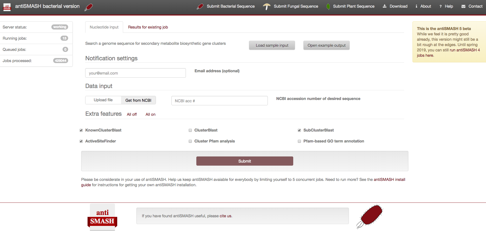


---


[https://antismash.secondarymetabolites.org/](https://antismash.secondarymetabolites.org/)


---

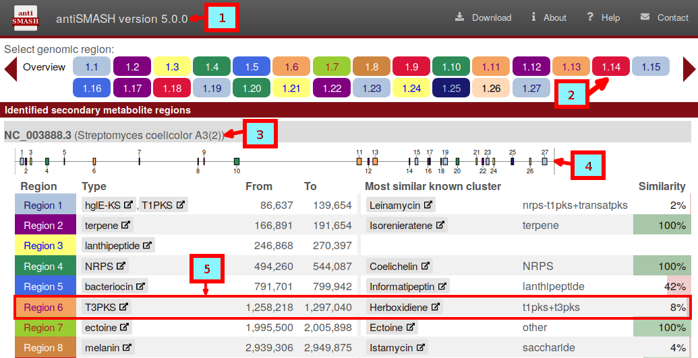

---

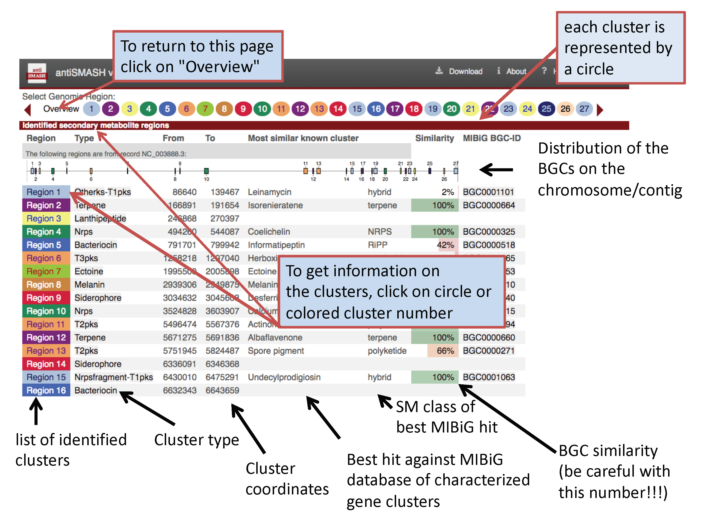

---

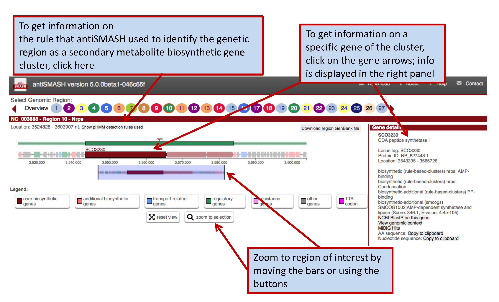

---

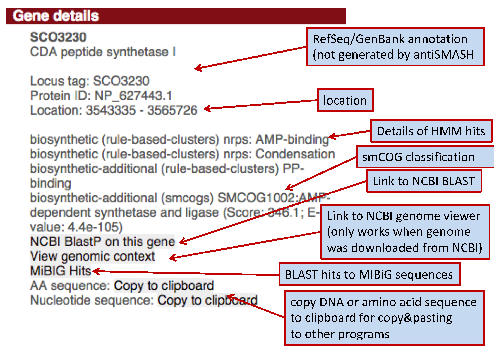

---

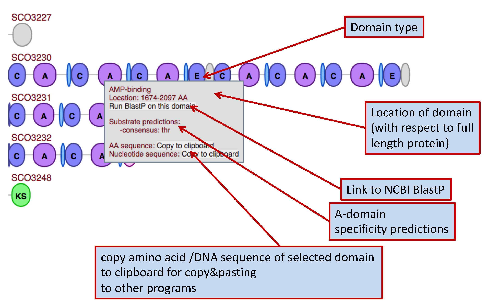

---

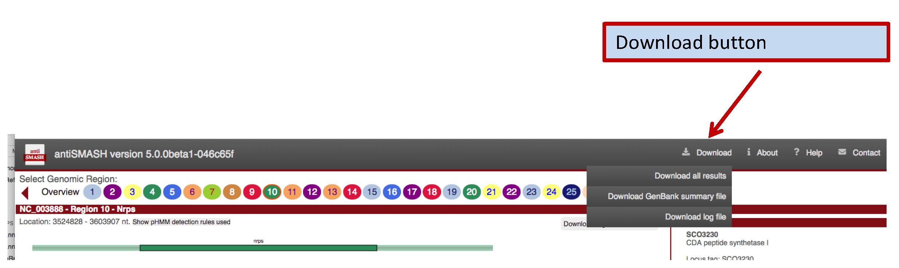

---


---


---


[https://git.wageningenur.nl/medema-group/BiG-SCAPE](https://git.wageningenur.nl/medema-group/BiG-SCAPE)

---

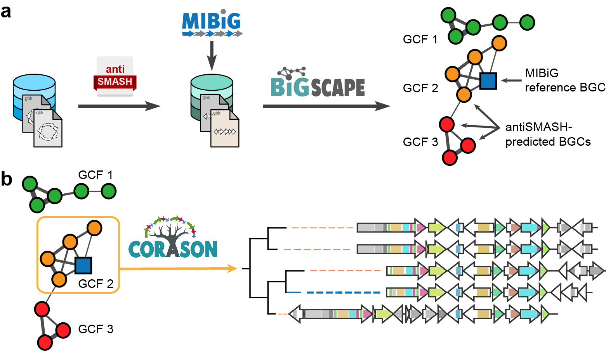

---

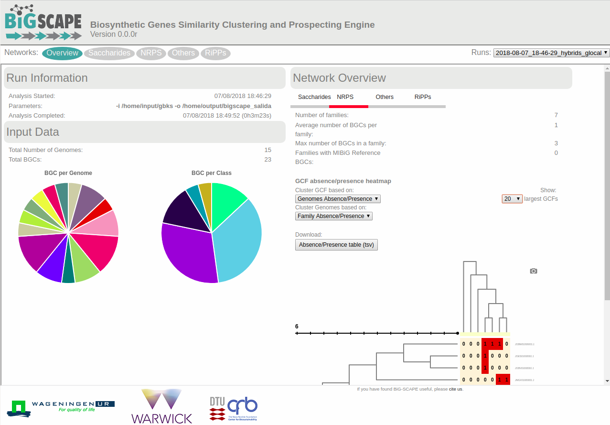

---

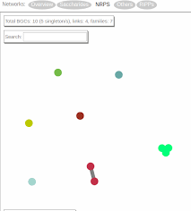

---

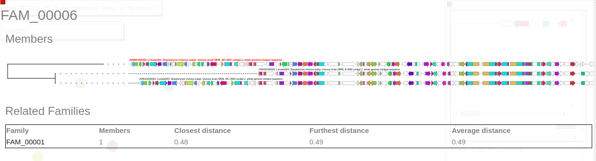

---


---


---


---


---
class: inverse
background-image: url('assets/img/image2.png')
background-size: cover


---
class: inverse
background-image: url('assets/img/image5.png')
background-size: cover


---
class: inverse
background-image: url('assets/img/image1.jpeg')
background-size: cover


---
class: inverse
background-image: url('assets/img/image4.jpeg')
background-size: cover


---
class: inverse
background-image: url('assets/img/image3.jpeg')
background-size: cover

